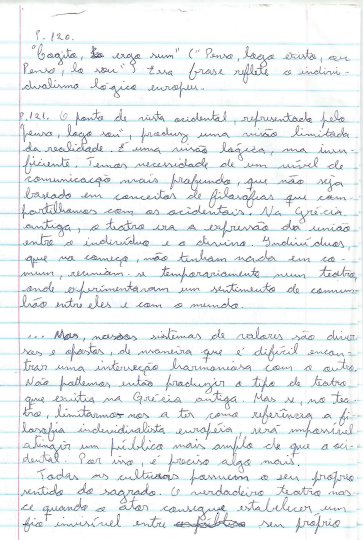
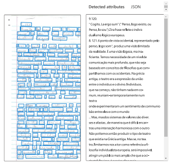

# Azure Recognization Text

# Technique Used
Handwritten text detection was performed using Azure's AI service, which likely employs an optical character recognition (OCR) model trained to recognize and transcribe handwritten text in images.

# Results Obtained
The text detection result was quite accurate, despite the low image resolution. The extracted text was:

## Case Study:
### Challenge:
The image was low resolution, and the text was spliced, presenting a challenge for detecting handwritten text.

## Input

### Approach:
Azure's AI service demonstrated great effectiveness in dealing with the challenge presented, managing to accurately extract the maximum content from the handwritten text even in suboptimal conditions.

## Output

### Potential Applications:
- Improvements in OCR for handwritten texts.
- Processing old or low-quality documents.
- Support for the transcription of handwritten texts in historical research.

### Conclusion:
The technique used proved to be robust, providing very accurate results in detecting handwritten text. This case study highlights the ability of Azure's AI service to address challenges related to image resolution and clarity, expanding its applications in several areas.